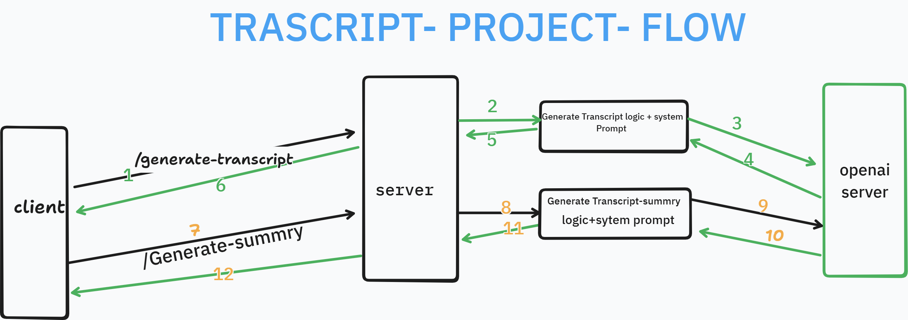

 (1.) Transcript Project

    This project generates a customer support call transcript and also creates a summary using OpenAI API.
 (2.)Features
     Generate realistic customer support transcripts
     Summarize transcripts
     Save transcript and summary into files
     REST API using Express.js
 (3.) Technologies Used
      JavaScript
      Node.js
      Express.js
      OpenAI API
      dotenv
      LangChain
 (4.) Error Handling
      Invalid API key handling
      Server error responses
      Empty request validation

 (5.) Project flow image.png   
      

LangChain integration
- **Setup**: create a `.env` file in the project root with `OPENAI_API_KEY=your_key`.
- **Install**: dependencies are listed in `package.json` (includes `langchain` and `openai`).
- **Test summarizer**: run the local test (reads `transcript.txt`):

```bash
npm run test-summarizer
```

If you want the project to use LangChain-based summarization in the API, the `/generate-summary` endpoint already calls the summarizer in `transcriptSummarizer.js`.

Postman quick test:
1. Run `npm start`.
2. Open `GET http://localhost:3000/health` to confirm the API is alive.
3. Open `POST http://localhost:3000/generate-summary` with JSON body:
   {
     "transcript": "Paste your transcript text here"
   }
4. You should receive a JSON response with `success: true` and a human-friendly summary.
